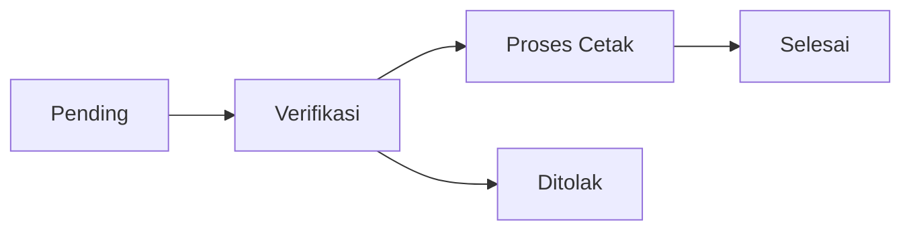

# 🔐 Security & Kartu Keluarga (KK) Documentation

## 📋 Table of Contents
- [Security Features](#-security-features)
- [Kartu Keluarga (KK) System](#-kartu-keluarga-kk-system)
- [API Security](#-api-security)
- [Data Protection](#-data-protection)
- [Best Practices](#-best-practices)

---

## 🔒 Security Features

### 1. Authentication & Authorization

#### **Email Verification dengan OTP**
Sistem menggunakan verifikasi OTP (One-Time Password) untuk memastikan keamanan akun pengguna:

```php
// User Model - app/Models/User.php
public function generateOtp(): string
{
    $otp = str_pad(random_int(0, 999999), 6, '0', STR_PAD_LEFT);
    
    $this->update([
        'otp_code' => $otp,
        'otp_expires_at' => Carbon::now()->addMinutes(5), // OTP kadaluarsa dalam 5 menit
    ]);

    return $otp;
}
```

**Fitur Keamanan OTP:**
- ✅ OTP 6 digit yang di-generate secara random
- ✅ Waktu kadaluarsa 5 menit
- ✅ OTP di-hash dan disimpan dengan aman
- ✅ Otomatis dihapus setelah verifikasi berhasil

#### **Middleware Protection**
Aplikasi ini menggunakan beberapa middleware untuk melindungi routes:

1. **Auth Middleware** - Memastikan user sudah login
2. **Verified Middleware** - Memastikan user sudah verifikasi email
3. **Admin Middleware** - Membatasi akses ke halaman admin

```php
// AdminMiddleware - app/Http/Middleware/AdminMiddleware.php
public function handle(Request $request, Closure $next): Response
{
    // Check if user is authenticated
    if (!Auth::check()) {
        return redirect()->route('login')->with('error', 'Please login to access admin area.');
    }

    // Check if user is admin based on email
    $user = Auth::user();
    if ($user->email !== 'admin123@gmail.com') {
        return redirect()->route('dashboard')->with('error', 'Access denied. Admin privileges required.');
    }

    return $next($request);
}
```

### 2. Password Security

#### **Password Hashing**
Semua password pengguna di-hash menggunakan bcrypt:

```php
protected function casts(): array
{
    return [
        'password' => 'hashed', // Automatic password hashing
    ];
}
```

#### **Password Protection**
Password tidak pernah ditampilkan dalam response:

```php
protected $hidden = [
    'password',
    'remember_token',
    'otp_code',
];
```

### 3. API Security

#### **API Key Middleware (Optional)**
Sistem mendukung API Key authentication untuk production:

```php
// ApiKeyMiddleware - app/Http/Middleware/ApiKeyMiddleware.php
public function handle(Request $request, Closure $next): Response
{
    $apiKey = $request->header('X-API-Key') ?? $request->get('api_key');
    
    // CORS headers untuk keamanan
    $response = $next($request);
    
    if (method_exists($response, 'header')) {
        $response->header('Access-Control-Allow-Origin', '*');
        $response->header('Access-Control-Allow-Methods', 'GET, POST, PUT, DELETE, OPTIONS');
        $response->header('Access-Control-Allow-Headers', 'Content-Type, Authorization, X-API-Key');
    }

    return $response;
}
```

**Catatan:** API key validation di-comment untuk development. Aktifkan untuk production!

### 4. CSRF Protection

Laravel otomatis melindungi semua POST, PUT, PATCH, dan DELETE requests dengan CSRF token.

### 5. Input Validation

Semua input user di-validasi sebelum diproses:

```php
// Contoh validasi KK
$validator = Validator::make($request->all(), [
    'no_kk' => 'required|string|min:16|max:16',
    'nama_kepala_keluarga' => 'required|string|max:255',
    'nik_kepala_keluarga' => 'required|string|min:16|max:16',
    'alamat' => 'required|string',
    // ... validasi lainnya
]);
```

---

## 👨‍👩‍👧‍👦 Kartu Keluarga (KK) System

### 1. Data Model

#### **Database Schema**
Tabel `data_kk` menyimpan semua informasi Kartu Keluarga:

```php
Schema::create('data_kk', function (Blueprint $table) {
    $table->id();
    $table->foreignId('user_id')->constrained()->onDelete('cascade');
    $table->string('no_pengajuan')->unique();
    
    // Data Kepala Keluarga
    $table->string('no_kk', 16)->unique();
    $table->string('nama_kepala_keluarga');
    $table->string('nik_kepala_keluarga', 16);
    
    // Data Alamat
    $table->text('alamat');
    $table->string('provinsi');
    $table->string('kabupaten');
    $table->string('kecamatan');
    $table->string('kelurahan');
    $table->string('rt', 3);
    $table->string('rw', 3);
    $table->string('kode_pos', 5);
    $table->string('no_telepon')->nullable();
    
    // Data Anggota Keluarga (JSON)
    $table->json('anggota_keluarga');
    
    // Dokumen Pendukung
    $table->string('surat_nikah_path')->nullable();
    $table->string('akta_kelahiran_path')->nullable();
    $table->string('ktp_kepala_keluarga_path')->nullable();
    $table->string('surat_pindah_path')->nullable();
    
    // Status Pengajuan
    $table->enum('status', ['pending', 'verifikasi', 'proses_cetak', 'selesai', 'ditolak'])
          ->default('pending');
    $table->text('catatan')->nullable();
    $table->timestamp('tanggal_pengajuan')->useCurrent();
    $table->timestamp('tanggal_selesai')->nullable();
    
    $table->timestamps();
});
```

#### **Model Relationships**

```php
// User Model
public function dataKk(): HasMany
{
    return $this->hasMany(DataKk::class);
}

public function latestKk()
{
    return $this->dataKk()->latest()->first();
}

// DataKk Model
public function user(): BelongsTo
{
    return $this->belongsTo(User::class);
}
```

### 2. Fitur Utama KK System

#### **A. Auto-Generated Application Number**

Setiap pengajuan KK mendapat nomor unik:

```php
public static function generateNoPengajuan(): string
{
    $year = date('Y');
    $month = date('m');
    $lastNumber = self::whereYear('created_at', $year)
                     ->whereMonth('created_at', $month)
                     ->count() + 1;
    
    return "KK-{$year}{$month}-" . str_pad($lastNumber, 4, '0', STR_PAD_LEFT);
}
```

**Format:** `KK-YYYYMM-XXXX`
- Contoh: `KK-202412-0001`

#### **B. Multi-Step Application Flow**



**Status Workflow:**
1. **Pending** - Menunggu verifikasi (estimasi: 1-2 hari)
2. **Verifikasi** - Sedang diverifikasi admin (estimasi: 3-5 hari)
3. **Proses Cetak** - Sedang dicetak (estimasi: 1-2 hari)
4. **Selesai** - Pengajuan selesai
5. **Ditolak** - Pengajuan ditolak oleh admin

#### **C. Family Members Management**

Data anggota keluarga disimpan dalam format JSON:

```php
protected $casts = [
    'anggota_keluarga' => 'array',
    'tanggal_pengajuan' => 'datetime',
    'tanggal_selesai' => 'datetime',
];
```

**Struktur Data Anggota Keluarga:**

```json
[
    {
        "nama": "Ahmad Wijaya",
        "nik": "3201011234567890",
        "jenis_kelamin": "L",
        "tempat_lahir": "Jakarta",
        "tanggal_lahir": "1985-05-15",
        "agama": "Islam",
        "pendidikan": "Diploma IV/Strata I",
        "pekerjaan": "Pegawai Swasta",
        "status_perkawinan": "Kawin",
        "status_hubungan": "Kepala Keluarga",
        "kewarganegaraan": "WNI"
    }
]
```

#### **D. Document Upload**

Sistem mendukung upload 4 jenis dokumen:
- ✅ **Akta Kelahiran** (wajib, max 2MB)
- ✅ **KTP Kepala Keluarga** (wajib, max 2MB)
- ✅ **Surat Nikah** (opsional, max 2MB)
- ✅ **Surat Pindah** (opsional, max 2MB)

```php
private function uploadFile($file, $directory)
{
    if (!$file) {
        return null;
    }

    $filename = time() . '_' . uniqid() . '.' . $file->getClientOriginalExtension();
    return $file->storeAs($directory, $filename, 'public');
}
```

**Security Features:**
- File size validation (max 2MB)
- Unique filename generation untuk mencegah overwrite
- Automatic cleanup jika database insert gagal
- File deletion saat aplikasi dibatalkan

#### **E. Validation Rules**

Sistem melakukan validasi ketat untuk semua input:

```php
$validator = Validator::make($request->all(), [
    // Kepala Keluarga Data
    'no_kk' => 'required|string|min:16|max:16',
    'nama_kepala_keluarga' => 'required|string|max:255',
    'nik_kepala_keluarga' => 'required|string|min:16|max:16',
    
    // Address Data
    'alamat' => 'required|string',
    'provinsi' => 'required|string|max:255',
    'kabupaten' => 'required|string|max:255',
    'kecamatan' => 'required|string|max:255',
    'kelurahan' => 'required|string|max:255',
    'rt' => 'required|string|max:3',
    'rw' => 'required|string|max:3',
    'kode_pos' => 'required|string|min:5|max:5',
    
    // Family Members
    'anggota_keluarga' => 'required|array|min:1',
    
    // Documents
    'akta_kelahiran' => 'required|file|max:2048',
    'ktp_kepala_keluarga' => 'required|file|max:2048',
    'surat_nikah' => 'nullable|file|max:2048',
    'surat_pindah' => 'nullable|file|max:2048',
    
    // Agreement
    'pernyataan' => 'required|accepted',
]);
```

### 3. API Endpoints

#### **User Routes (Protected)**

```php
// Create new KK application
Route::get('/pengajuan-kk-baru', [KkController::class, 'create'])->name('kk.create');
Route::post('/pengajuan-kk-baru', [KkController::class, 'store'])->name('kk.store');

// View KK details
Route::get('/kk/{id}', [KkController::class, 'show'])->name('kk.show');

// Cancel KK application (only pending)
Route::delete('/kk/{id}/cancel', [KkController::class, 'cancel'])->name('kk.cancel');

// API routes
Route::get('/api/kk/applications', [KkController::class, 'getUserApplications']);
Route::post('/api/kk/check-no-kk', [KkController::class, 'checkNoKk']);
```

#### **Admin Routes (Protected)**

```php
Route::middleware(['auth', 'verified', 'admin'])->group(function () {
    Route::post('/admin/applications/{id}/approve', [AdminController::class, 'approveApplication']);
    Route::post('/admin/applications/{id}/reject', [AdminController::class, 'rejectApplication']);
    Route::post('/admin/applications/{id}/complete', [AdminController::class, 'completeApplication']);
    Route::get('/admin/applications/{id}/details', [AdminController::class, 'getApplicationDetails']);
});
```

### 4. Business Logic & Features

#### **A. Prevent Duplicate Applications**

User tidak bisa submit pengajuan baru jika masih ada pengajuan aktif:

```php
public function create()
{
    $existingApplication = Auth::user()->dataKk()
        ->whereIn('status', ['pending', 'verifikasi', 'proses_cetak'])
        ->first();

    if ($existingApplication) {
        return redirect()->route('dashboard')
                       ->with('warning', 'Anda sudah memiliki pengajuan KK yang sedang diproses.');
    }

    return view('app.pages.pengajuan-kk-baru');
}
```

#### **B. No. KK Availability Check**

Sistem memeriksa apakah No. KK sudah terdaftar:

```php
public function checkNoKk(Request $request)
{
    $noKk = $request->input('no_kk');
    
    if (strlen($noKk) !== 16) {
        return response()->json([
            'available' => false,
            'message' => 'No. KK harus terdiri dari 16 digit.'
        ]);
    }

    $exists = DataKk::where('no_kk', $noKk)->exists();

    return response()->json([
        'available' => !$exists,
        'message' => $exists ? 'No. KK sudah terdaftar dalam sistem.' : 'No. KK tersedia.'
    ]);
}
```

#### **C. Status Badge & Label**

Model menyediakan helper methods untuk UI:

```php
public function getStatusBadgeAttribute(): string
{
    return match($this->status) {
        'pending' => 'bg-gray-100 text-gray-800',
        'verifikasi' => 'bg-yellow-100 text-yellow-800',
        'proses_cetak' => 'bg-blue-100 text-blue-800',
        'selesai' => 'bg-green-100 text-green-800',
        'ditolak' => 'bg-red-100 text-red-800',
        default => 'bg-gray-100 text-gray-800',
    };
}

public function getStatusLabelAttribute(): string
{
    return match($this->status) {
        'pending' => 'Menunggu Verifikasi',
        'verifikasi' => 'Verifikasi Data',
        'proses_cetak' => 'Proses Cetak',
        'selesai' => 'Selesai',
        'ditolak' => 'Ditolak',
        default => 'Unknown',
    };
}
```

#### **D. Query Scopes**

Model menyediakan scopes untuk filtering:

```php
// Filter by status
public function scopeByStatus($query, $status)
{
    return $query->where('status', $status);
}

// Filter by user
public function scopeForUser($query, $userId)
{
    return $query->where('user_id', $userId);
}
```

**Usage:**
```php
// Get all pending KK applications for a user
$pendingKk = DataKk::forUser($userId)->byStatus('pending')->get();
```

#### **E. Cancel Application**

User dapat membatalkan pengajuan yang masih pending:

```php
public function cancel($id)
{
    $dataKk = DataKk::where('user_id', Auth::id())
                   ->where('id', $id)
                   ->where('status', 'pending')
                   ->firstOrFail();

    try {
        // Delete uploaded files
        if ($dataKk->surat_nikah_path) {
            Storage::delete($dataKk->surat_nikah_path);
        }
        // ... delete other files

        $dataKk->delete();

        return response()->json([
            'success' => true,
            'message' => 'Pengajuan KK berhasil dibatalkan.'
        ]);

    } catch (\Exception $e) {
        Log::error('Cancel KK Application Error: ' . $e->getMessage());
        // ... error handling
    }
}
```

**Security Features:**
- ✅ Hanya user pemilik yang bisa cancel
- ✅ Hanya pengajuan dengan status 'pending' yang bisa dibatalkan
- ✅ Auto-delete semua file yang di-upload
- ✅ Transaction safety dengan try-catch
- ✅ Error logging untuk debugging

---

## 🛡️ API Security

### Public API Routes

Beberapa endpoint tersedia tanpa authentication untuk keperluan public:

```php
// Test API connection
Route::get('/api/test', function () {
    return ['success' => true, 'message' => 'API working!'];
});

// Get KTP by NIK
Route::get('/api/ktp/nik/{nik}', function ($nik) {
    // ... implementation
});
```

### Rate Limiting

> **⚠️ Important:** Implementasikan rate limiting untuk production!

```php
// Tambahkan ke RouteServiceProvider
RateLimiter::for('api', function (Request $request) {
    return Limit::perMinute(100)->by($request->user()?->id ?: $request->ip());
});
```

---

## 🔐 Data Protection

### 1. File Storage Security

- Semua dokumen disimpan di `storage/app/public`
- Symbolic link ke `public/storage` untuk akses
- File naming menggunakan timestamp + unique ID

### 2. Database Security

- Foreign key constraints untuk data integrity
- Cascade delete untuk membersihkan orphaned records
- Unique constraints pada No. KK dan No. Pengajuan

### 3. Error Handling

```php
try {
    // Create KK application
    $dataKk = DataKk::create([...]);

    return response()->json([
        'success' => true,
        'message' => 'Pengajuan KK berhasil disubmit!'
    ]);

} catch (\Exception $e) {
    Log::error('KK Application Error: ' . $e->getMessage());
    
    // Clean up uploaded files if database insert fails
    if (isset($suratNikahPath)) Storage::delete($suratNikahPath);
    // ... cleanup other files

    return response()->json([
        'success' => false,
        'message' => 'Terjadi kesalahan saat memproses pengajuan. Silakan coba lagi.'
    ], 500);
}
```

---

## 📝 Best Practices

### 1. Untuk Developer

#### **Environment Configuration**
```bash
# .env
APP_ENV=production
APP_DEBUG=false
APP_URL=https://yourdomain.com

# Aktifkan API Key untuk production
# Uncomment validasi di ApiKeyMiddleware.php
```

#### **Database Backup**
```bash
# Regular backup schedule
php artisan backup:run
```

#### **Security Headers**
Tambahkan security headers di middleware atau web server:
```
X-Frame-Options: DENY
X-Content-Type-Options: nosniff
X-XSS-Protection: 1; mode=block
```

### 2. Untuk Admin

#### **Admin Account Security**
- ✅ Gunakan email yang kuat dan unik
- ✅ Jangan share credentials admin
- ✅ Ganti email admin di `AdminMiddleware.php`:

```php
if ($user->email !== 'admin123@gmail.com') { // Ganti dengan email admin yang benar
    return redirect()->route('dashboard')->with('error', 'Access denied.');
}
```

#### **Review Aplikasi Secara Berkala**
- Periksa aplikasi pending
- Verifikasi dokumen dengan teliti
- Berikan catatan jika ada penolakan

### 3. Untuk User

#### **Data Privacy**
- Pastikan data yang diinput benar
- Upload dokumen yang jelas dan valid
- Jangan share nomor pengajuan ke pihak lain

#### **Document Requirements**
- Format: JPG, PNG, PDF
- Ukuran maksimal: 2MB per file
- Pastikan dokumen asli dan sah

---

## 📊 Sample Data

### Seeder Data

File `DataKkSeeder.php` menyediakan sample data untuk testing:

```php
// 3 sample KK applications dengan berbagai status:
// 1. Status: pending (Jakarta)
// 2. Status: verifikasi (Bandung)
// 3. Status: selesai (Yogyakarta)
```

**Running Seeder:**
```bash
php artisan db:seed --class=DataKkSeeder
```

---

## 🔍 Monitoring & Logging

### Error Logging

Semua error di-log untuk debugging:

```php
Log::error('KK Application Error: ' . $e->getMessage());
```

**Log Location:** `storage/logs/laravel.log`

### Application Monitoring

Monitor metrics penting:
- Total aplikasi KK
- Status distribution (pending, verifikasi, etc.)
- Response time
- Error rate

---

## 📞 Support

Untuk pertanyaan atau issue terkait security dan KK system:
- Email: support@example.com
- Documentation: [Link to full docs]
- Issue Tracker: [GitHub Issues]

---

## 📄 License

This project follows the same license as the main application.

---

**Last Updated:** December 2024  
**Version:** 1.0.0
